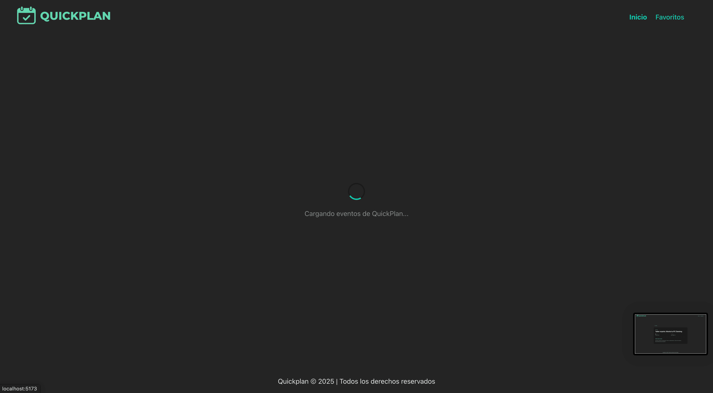
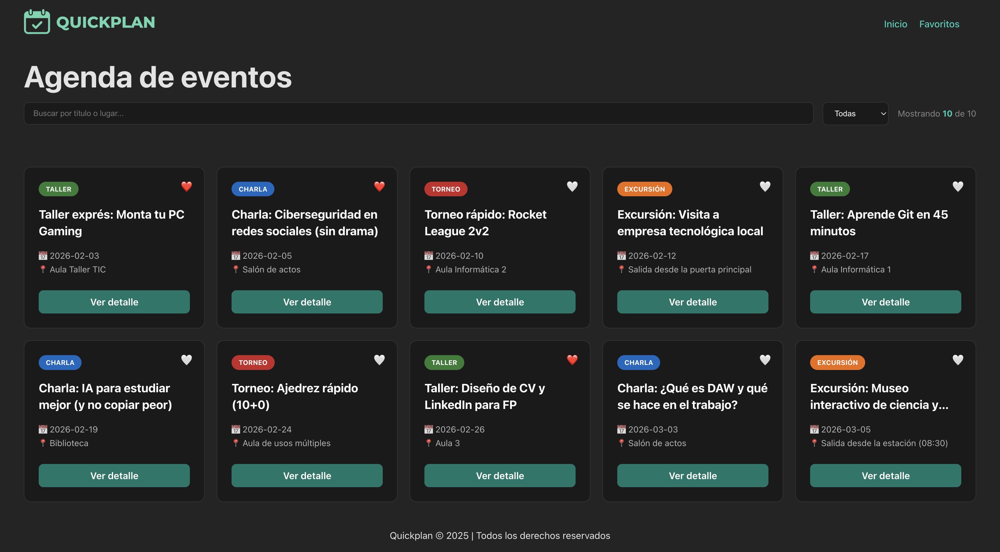
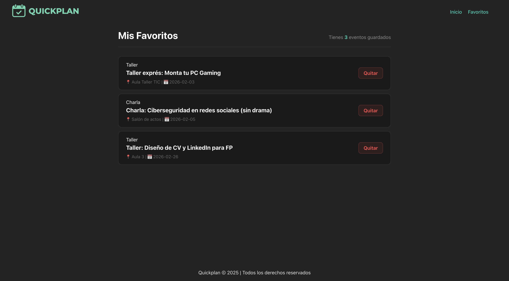
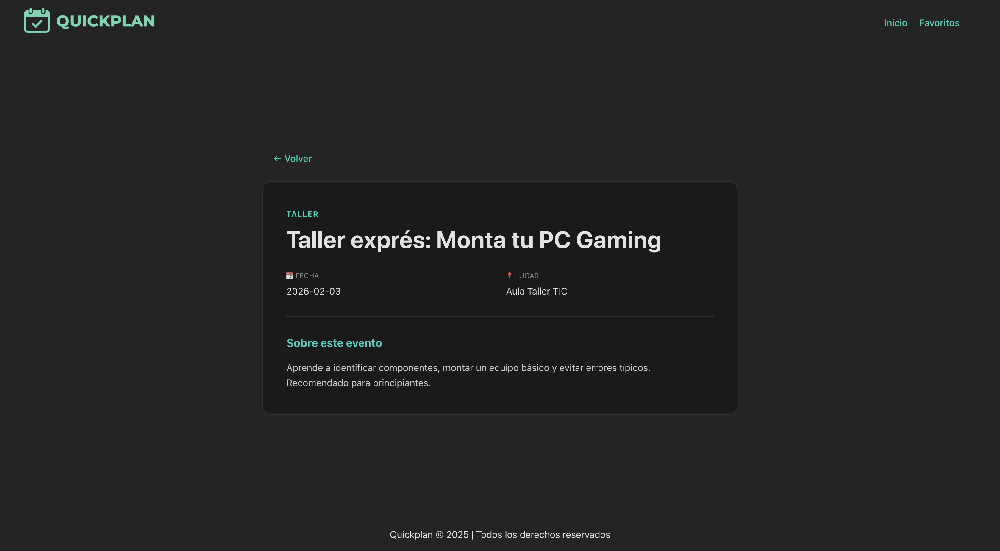
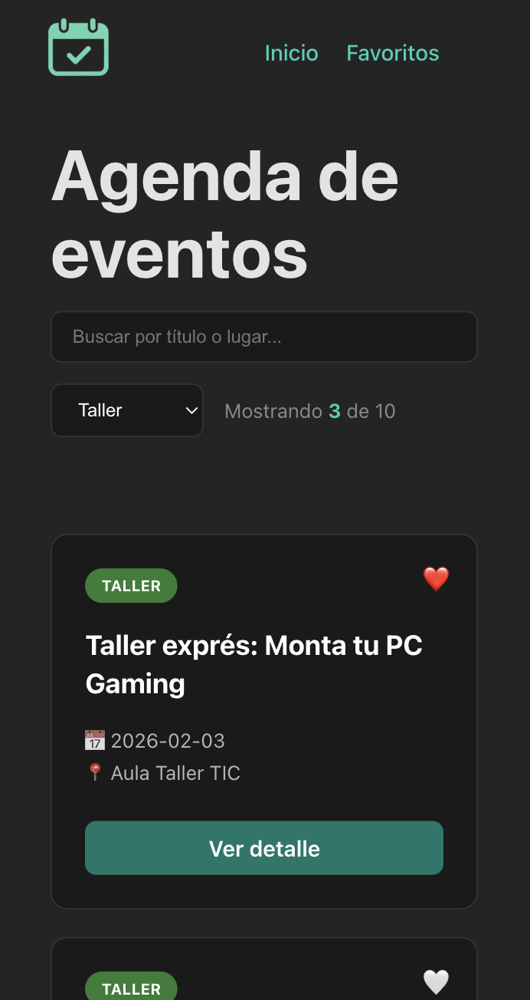

# Quickplan - Agenda de eventos

## ¿Qué es Quickplan?

QuickPlan es una aplicación de página única (**SPA**) **completamente responsive** desarrollada con **React** para la exploración, filtrado y gestión de eventos. Los usuarios pueden navegar por un catálogo de eventos, realizar búsquedas dinámicas, filtrar por categorías, consultar información detallada y mantener una lista personalizada de favoritos que persiste entre sesiones del navegador.

---

## 📸 Vista Previa

### Estado de Carga (Loading)

> Implementación de *feedback* visual mientras se obtienen los datos de los eventos.

<div align="center">
  
</div>
<br>

### Exploración y Gestión

<div align="center">
  <table>
    <tr>
      <td><p align="center"><b>Pantalla Principal</b></p></td>
      <td><p align="center"><b>Mis Favoritos</b></p></td>
    </tr>
    <tr>
      <td></td>
      <td></td>
    </tr>
    <tr>
      <td colspan="2"><p align="center"><b>Detalle del Evento</b></p></td>
    </tr>
    <tr>
      <td colspan="2" align="center"></td>
    </tr>
  </table>
</div>

### Adaptación Móvil

> La aplicación detecta el tamaño de pantalla y ajusta el diseño y el logo para una mejor experiencia.

<div align="center">
  
  <br>
  <i>Interfaz adaptada con cambio de logo dinámico</i>
</div>

---

## 🛠️ Stack tecnológico

### 🚀 Tecnologías Principales

#### Framework Frontend

- **React 19.2.0** con React DOM 19.2.0
- **React Router DOM 7.11.0** para routing *client-side*

#### Herramientas de Build y Desarrollo

- **Vite 7.2.4** - Servidor desarrollo y build de producción
- **@vitejs/plugin-react 5.1.2** para transformación JSX y Fast Refresh vite.config.js:1-7

#### Calidad de Código

- **ESLint 9.39.1** con configuración *flat format*
- Plugins para React hooks y React Refresh

#### Sistema de Módulos

- **ES Modules** con `"type": "module"`

### 📦 Scripts Disponibles

```bash
npm run dev      # Iniciar servidor desarrollo con HMR  
npm run build    # Build para producción  
npm run lint     # Ejecutar ESLint  
npm run preview  # Previsualizar build de producción
```

---

## 🧠 Arquitectura de la Aplicación

### Estructura de Rutas

La aplicación utiliza **react-router-dom** para definir una navegación fluida sin recargas de página:

- `/`: Página principal con el listado completo y filtros.

- `/favorites`: Vista de los eventos guardados por el usuario.

- `/evento/:id`: Vista de detalle con información extendida de un evento específico.

### Punto de entrada

La aplicación se inicializa en `src/main.jsx` con `StrictMode` y `BrowserRouter`, montándose en el elemento `#root` del HTML.

### Gestión de Estado y Persistencia

QuickPlan implementa un `FavoritesProvider` mediante la **Context API** de React. Esta arquitectura permite:

- **Estado Global**: Acceso a los favoritos desde cualquier componente (`Home`, `Card`, `EventDetail`) sin prop drilling.

- **Persistencia**: Sincronización automática con localStorage, asegurando que los favoritos se mantengan tras cerrar el navegador.

### Estructura de Directorios

```text
src/
├── components/ # Componentes de UI (Card, Grid, Header, Layout)
├── context/    # Lógica de estado global (FavoritesContext)
├── data/       # Datos estáticos (eventos.json)
├── pages/      # Vistas de la aplicación (Home, Favorites, EventDetail)
└── main.jsx    # Punto de entrada y configuración global
```

---

## 📝 Notas de Implementación

- **JavaScript Moderno**: El proyecto utiliza definiciones de tipo para React para mejorar el autocompletado en el IDE.

- **Build**: Vite gestiona el proceso de construcción utilizando Rollup internamente para generar activos altamente optimizados.

- **Diseño**: Interfaz minimalista optimizada para modo oscuro, utilizando variables CSS para una gestión eficiente de colores y espaciados.

---

## 🚀 Instalación y Uso

1. Clona el repositorio: 
```bash
git clone https://github.com/yriaforjan/quickplan.git
```

2. Instala las dependencias: 
```bash
npm install
```

3. Lanza el proyecto: 
```bash
npm run dev
```

---

## 📄 Licencia

Este proyecto es de **carácter escolar y educativo**, desarrollado como proyecto de la asignatura *Despliegue de aplicaciones web* en el grado superior de *DAW*.

---

## 👩🏼‍💻 Autor

Desarrollado por **Yria Forján Oliveira**.